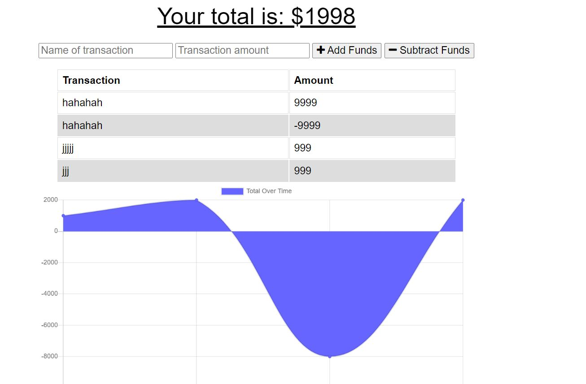

<h1 align="center"> Web Applications (PWA) Challenge: Budget Tracker 👋</h1>
  

    
    
    
    
    
    

  

    
    
    
    
    

   
<h4>Designed and coded by <a href="https://github.com/fizzaaz">FIZZA ZAIDI</a></h4> 

## Description

🔍Giving users a fast and easy way to track their money is important, but allowing them to access that information at any time is even more important. Having offline functionality is paramount to the success of an application that handles users’ financial information.
Budget Tracker is a progressive web application that allows users to track their budgets by adding expenses and deposits to their budget through the "Add/Subtract Funds" buttons. They are able to add a transaction with or without a connection. When a user enters a transaction while offline, these transactions are stored in the indexedDB, and transferred to the database when the user comes back online.

✋ [GitHub Repository](https://github.com/fizzaaz/budget-tracker)

✋ [Deployed App](https://pwa-budgetracker.herokuapp.com/)

## ✋User Requirements

AS AN avid traveler
I WANT to be able to track my withdrawals and deposits with or without a data/internet connection
SO THAT my account balance is accurate when I am traveling 

## ✋Project Requirements

GIVEN a budget tracker without an internet connection
* WHEN the user inputs an expense or deposit THEN they will receive a notification that they have added an expense or deposit
* WHEN the user reestablishes an internet connection THEN the deposits or expenses added while they were offline are added to their transaction history and their totals are updated

## Table of Contents
- [Description](#description)
- [User Requirements](#user-requirements)
- [Project Requirements](#project-requirements)
- [Installation](#installation)
- [Usage](#usage)
- [Testing](#testing)
- [Contribution](#contribution)
- [Questions](#questions)

## 💻Usage
  
Run the following command at the root of your project :
  
`npm start`     

To access the app after starting the server, go to http://localhost:3000 in your browser or go to https://pwa-budgetracker.herokuapp.com/.

## 💾Installation

`npm i install`

`npm i express`

`npm i mongoose`

## ✏️Testing

No testing is currently set up

## 👪Contribution

  Email me 

## Questions

 If you have any queries feel free to contact me at ✉️ fizz.zehra14@gmail.com.
 You can also reach me out through my Github profile at  👋[fizzaaz](https://github.com/fizzaaz/).

